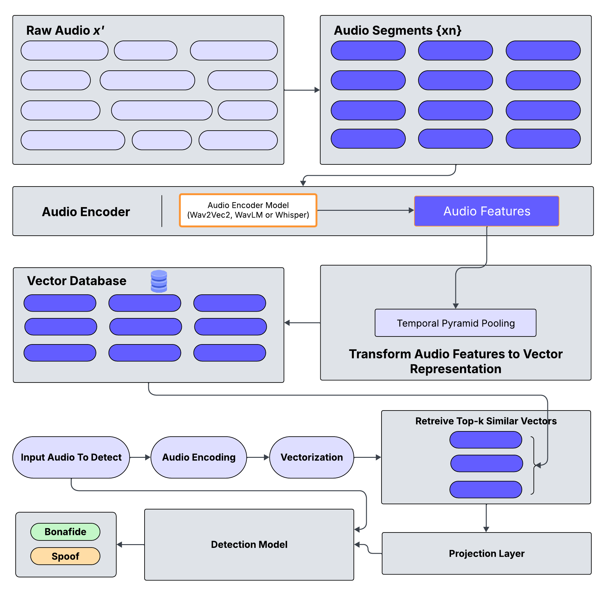

# RADAD-RetrievalAugmentedDeepfakeAudioDetection
Retrieval Augmented Framework for Deepfake Audio Detection

This repository is for my ongoing research work as part of Master's program in Aritificial Intelligent at SJSU.

Advisor: Prof. Kaikai Liu

Author: Avinash Saxena

---
## Architecture Overview




-----
## Code setup and execution instructions

1. Download and unzip the dataset
```
wget https://owncloud.fraunhofer.de/index.php/s/JZgXh0JEAF0elxa/download
```

2. Install required libraries
```
pip install -r requirements.txt
```

3. Run main.py for training, evaluation or prediction
For training:
```
python deepfake_detection.py --mode train
```

For evaluation:
```
python deepfake_detection.py --mode evaluate --model_prefix best_model
```

For Prediction:
```
python deepfake_detection.py --mode predict --audio_path /path/to/audio.wav
```


# In progress work:
* Implement different projection layer mechanisms
* Implement different vectorization mechanisms
* Train and evaluate on different datasets
* Optimize the data preprocessing, model and training further.


